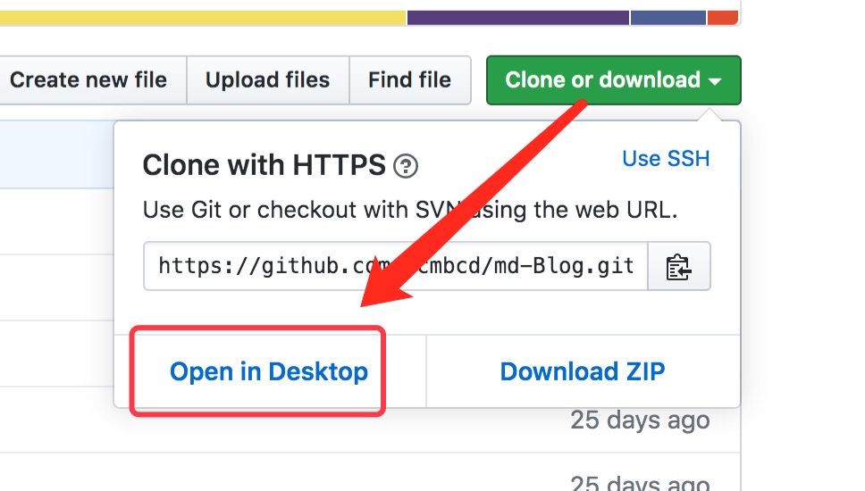

# # 安装

## 源码安装

下载地址：https://github.com/ycmbcd/md-Blog/releases

下载源码包后，解压到配置好的站点目录即可。

## Git 克隆安装

克隆地址：https://github.com/ycmbcd/md-Blog.git

> git clone https://github.com/ycmbcd/md-Blog.git

## 通过 GitHub Desktop 安装

打开项目地址：https://github.com/ycmbcd/md-Blog

你可以通过 [GitHub Desktop](https://desktop.github.com/) 克隆项目到本地站点目录。

