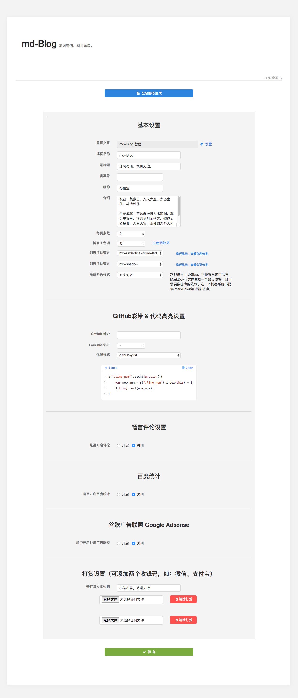

# # 使用

## 后台地址

- 有 ssl认证 的网站浏览器访问：https://您的域名/set/
- 无 ssl认证 的网站浏览器访问：http://您的域名/set/

## 上传 .md 文件

将你本地的 `MarkDown` 目录上传至网站根目录 `/md` 目录下。

## 目录结构

注意：本博客只支持一级栏目划分，请参照下列结构：

```html
/md
/md/西游记
/md/西游记/第一章.md
/md/西游记/第二章.md
...
/md/红楼梦
/md/红楼梦/第一回.md
/md/红楼梦/第二回.md
...
```

## 生成页面

放入后点击 **全站静态生成** 按钮，拿起茶杯的功夫，系统便自动生成好了您的博客。

